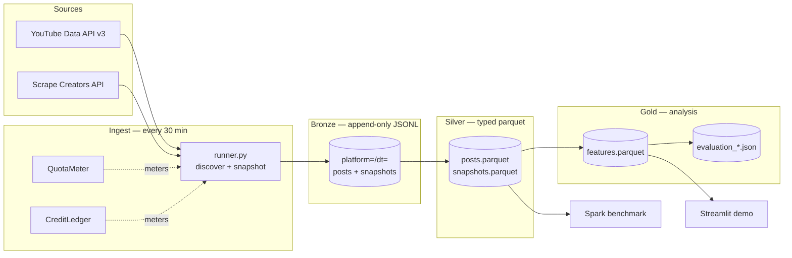

# Content Death Clock — Technical Report

## A quota-constrained longitudinal collection pipeline, and a measured pandas–Spark crossover

**Amogha V Prasad · S Anannya · Sanidhya Tiwari · Shubhang Srinivas Varda**
RV University, Bengaluru — 7th Semester, Big Data Analytics

> **Draft status.** Architecture, cost model, reliability analysis and the scalability
> benchmark are final and measured. Final dataset dimensions are `[PENDING]` until Cohort A
> closes on 2026-09-16.

---

## 1. What the system has to do, and why that is hard

The analytical goal is stated in the companion Research Methodology paper: predict when a
social media post stops receiving attention. The engineering consequence of that goal is the
whole of this report.

**Decay labels cannot be back-filled.** A post's first hour happens once. If the collector is
not running at t+1h, that observation does not exist and no amount of later effort recovers
it. Every design decision below follows from that single irreversibility.

Four constraints shape the system:

| Constraint | Consequence |
|---|---|
| **Wall-clock bound** — labels require weeks of repeated observation | Collection must be live before anything else is built, and must survive unattended |
| **Hard API quota** — YouTube Data API v3 gives 10,000 units/day | Cost per tracked post must be engineered, not discovered |
| **Non-renewable credits** — Instagram scraping costs money per call | Spending must be metered locally; the API returns no balance |
| **Append-only evidence** — raw observations are the study's primary data | Writes must be idempotent and must never rewrite history |

This is not a large dataset by volume, and the report does not pretend otherwise (§8). It is
a *long* dataset: the difficulty is temporal completeness and cost per observation, not
terabytes.

---

## 2. Architecture

A medallion pipeline. Each layer has exactly one job and can be rebuilt from the layer below.



### 2.1 Bronze — raw, append-only, partitioned

`data/bronze/platform={youtube,instagram}/dt=YYYY-MM-DD/{posts,snapshots}-<cycle>.jsonl`

Bronze is the study's evidence. It is never rewritten, never cleaned in place, and never
back-corrected. Every downstream layer is a pure function of it, so any transform decision can
be revisited without re-collecting.

### 2.2 Silver — typed, deduplicated, cross-platform

`transform/silver.py` normalises both platforms into one schema and resolves the substantive
per-platform difference explicitly: a `primary_metric` / `primary_value` pair, views for
YouTube and likes for Instagram, driven from config rather than hard-coded. Downstream code
reads `primary_value` and never needs to know which platform a row came from, while the choice
stays visible in the data so the paper can report it.

Three invariants enforced here:

1. **Deduplication.** Enforced again in silver even though the bronze writer already dedupes.
   A duplicated snapshot silently halves a velocity, so the guarantee is worth having twice.
2. **Ages recomputed from timestamps**, not trusted from what the collector wrote. If a clock
   or a publish time was ever corrected, the recomputed value is the honest one — and the two
   disagreeing is itself worth knowing about.
3. **Zero is not missing.** A hidden count arrives as null and stays null.

### 2.3 Gold — features and evaluation

`transform/features.py` builds the model matrix under a hard leakage boundary (§6).
`eval/report.py` runs the pre-registered evaluation and writes a machine-readable result.

---

## 3. The quota cost model

This is the section that makes the system a *big data* artefact rather than a script: the cost
of tracking a post was derived analytically, then measured against the derivation.

### 3.1 Derivation

Two endpoints matter, and they differ by two orders of magnitude in price:

| Call | Cost | Returns |
|---|---|---|
| `playlistItems.list` | **1 unit** | up to 50 recent uploads for one channel |
| `search.list` | **100 units** | search results |
| `videos.list` | **1 unit** | statistics for up to **50 video IDs** |

Discovery is done through each channel's **uploads playlist**, never through search. Using
`search.list` for discovery across 63 channels would cost 6,300 units per cycle and exhaust
the entire daily budget in under two cycles.

For a cycle with `C` frame channels and `V` posts due for re-measurement:

> **cost(cycle) = C + ceil(V / 50) units**

The first term is fixed by the size of the sampling frame. The second is the only term that
grows with the panel — and it grows at **1/50 of a unit per tracked post**.

### 3.2 Measurement

Measured over 41 logged YouTube cycles (`data/bronze/_cycles/`):

| Quantity | Measured |
|---|---|
| Units per cycle | median **65**, mean 64.3, range 33–67 |
| Units on `playlistItems` | 2,556 (**96.9%** of all spend) |
| Units on `videos` | 81 (3.1%) |
| Posts discovered | 153 |
| Snapshots taken | 740 |
| Posts due per cycle | median 5, max 116 |

The prediction was `C + ceil(V/50)` = 63 + 1..3 = **64–66 units**. The measured median is 65.
The model holds.

### 3.3 The headline cost result

At a 30-minute cadence (48 cycles/day):

> **≈ 3,120 units/day = 31% of the free 10,000-unit daily quota**, tracking 442 analysable
> posts across 63 channels.

Two consequences worth stating plainly:

- **Cost is dominated by frame size, not panel size.** 96.9% of quota goes to asking 63
  channels "anything new?" The marginal cost of one additional tracked post is **0.02 units
  per cycle** — the panel could grow roughly 50× before discovery stops dominating.
- **The system therefore scales sub-linearly in cost per tracked post.** Cost per post per day
  is currently ~7 units; at 5,000 tracked posts it would be ~0.7. This is the claim the BDA
  deliverable was built to support, and it is now measured rather than asserted.

### 3.4 Instagram: metering an API with no balance endpoint

Scrape Creators returns **no balance header**, so spending is invisible unless counted
locally. `CreditLedger` maintains a per-key ledger under `data/bronze/_credits/`, keyed by a
**SHA-256 fingerprint prefix of the key, never the key itself** — which is why it is safe to
commit alongside the data.

The ledger enforces a hard local cap and fails over across keys. Cohort A consumed 85 of 100
credits on the primary key across 16 rounds; 213 credits remain across three keys.

---

## 4. Reliability engineering: the scheduler was measured, not trusted

This was the most consequential engineering finding in the project.

### 4.1 The failure

Collection was originally scheduled with a GitHub Actions `cron`. GitHub does not guarantee
cron punctuality on free runners, and the documentation says so, but the size of the deviation
was the surprise:

- **Roughly one scheduled slot in three actually fired.** Mean gap between successful cycles:
  **3.03 hours** against a nominal 1 hour.
- One **7-hour overnight gap**.
- Consequence: **97.7% of posts lost their t+1h observation** — the single most valuable point
  on a decay curve, and the one that cannot ever be recovered.

The project's central irreversibility was being violated silently, by infrastructure, while
every workflow run showed green.

### 4.2 The fix

An **external scheduler** (cron-job.org) now triggers the workflow via `workflow_dispatch`
through a fine-grained personal access token scoped to a single repository with
Actions: read-and-write. The GitHub `cron` is retained as a fallback.

The `workflow_dispatch` entries in the run history are not manual runs; they are the external
scheduler firing.

**The fix helped, and an earlier version of this report overstated by how much.** We initially
recorded that t+1h capture went "from 2.1% to 100%". A later audit, measuring coverage strictly
— an observation counts for a mark only if it falls inside that mark's own tolerance window —
gave a very different picture:

| Posts published | t+1h | t+3h | t+6h | t+12h |
|---|---:|---:|---:|---:|
| Before the scheduler fix | 13% | 84% | 33% | 31% |
| After the scheduler fix | 45% | 97% | 93% | 92% |

The scheduler fix repaired t+3h, t+6h and t+12h completely. **t+1h stayed broken at 45%,** for
an entirely unrelated reason (§5.4), and two separate reporting weaknesses hid that: the
monitor was crediting late observations too generously (§4.4), and nothing was comparing
coverage against *eligibility*. The corrected figure is reported here rather than the flattering
one, and the post-repair rate is `[PENDING]` — it must be re-measured on posts published after
2026-09-01T20:45Z, when the second fix landed.

### 4.4 The monitoring lesson, part two: a metric that flatters is worse than none

The monitor credited a scheduled mark as covered by *any* observation up to six tolerance
widths later. For the t+1h mark that meant an observation taken at 3h counted as covering it.

So the monitor reported **96% coverage of a mark that was genuinely being hit 45% of the
time**, and the data-loss bug in §5.4 stayed invisible for days behind a green dashboard.

A late reading is real data, but it is not the measurement the schedule asked for, and for the
early marks it cannot substitute at all: velocity at 1h cannot be computed from an observation
taken at 3h. Coverage is now reported in two columns, on-time and late, and late credit can no
longer be claimed by an observation that falls inside the *next* mark's window.

The honest numbers over the full history, replacing a previously reported 90.9%:

| Metric | Reported before | Actual |
|---|---:|---:|
| Mean completeness | 90.9% | **76.9%** |
| On-time only | — | **68.0%** |

At t+6h the split is 93 on-time against 113 late — the same effect that forced the landmark to
move from 6h to 7h in the analysis plan.

**The general lesson, which belongs in the report because it cost us real data twice:** both
monitoring failures were failures of *generosity*. An alarm tuned to avoid false positives
stopped reporting true ones. A coverage metric tuned to be forgiving stopped measuring the
thing it was named after.

### 4.3 The monitoring lesson: an alarm that cries wolf is worse than none

The first completeness monitor alarmed whenever snapshot capture fell below 80%. Real capture
sits naturally at 79–82%, because a post admitted late legitimately misses its earliest marks.
The alarm therefore flapped constantly, and a constantly-flapping alarm is one nobody reads.

It was rewritten to fire only on conditions that are unambiguously wrong: a collection
**outage** (no successful cycle in a 12-hour window), or **collapse** (capture below 50% with
at least 50 posts in the panel). Normal jitter no longer alarms.

---

## 5. Correctness engineering: two bugs that would have destroyed the dataset

Both were found by tests and instrumentation rather than by inspection, and both are worth
reporting because they are the class of bug that produces *plausible* wrong numbers.

### 5.1 The bronze writer overwrote instead of merging

`cycle_id` has **hour** granularity, so at a 30-minute cadence two cycles in the same clock
hour target the same filename. The writer opened that file for writing.

The second cycle of every hour was therefore erasing the first. Silently. For what would have
been three weeks.

**Fix.** The writer now reads the existing file, merges by dedupe key — `(post_id,
snapshot_ts)` for snapshots, `(post_id,)` for posts — and writes atomically via a temporary
file and `os.replace`. A regression test writes two batches under one cycle id and asserts both
survive.

### 5.2 Discovery discarded statistics it had already paid for

The discovery call returns live view counts alongside video metadata. The original code kept
the metadata and threw the statistics away, then waited for the next cycle — an hour later —
to take a "first" snapshot.

That discarded observation was the **earliest measurement of the post we would ever have**, at
**zero additional quota cost**.

**Fix.** Discovery now writes an `at_discovery` snapshot immediately, flagged as such so the
analysis can distinguish it. The snapshot step then skips posts already snapshotted this
cycle, so nothing is paid for twice.

### 5.4 The at-discovery snapshot was swallowing the t+1h mark

The most expensive bug in the project, and a direct consequence of fixing §5.2.

`Panel.due` decided whether a post was owed an observation by comparing a **count** of
snapshots taken against a **count** of scheduled marks passed. Discovery writes a snapshot the
moment a post is found — median 14 minutes after publication, well before the t+1h window
opens — so that snapshot made every post look as though it had already satisfied its first
mark.

Every post was therefore permanently one observation behind, and **the mark it lost was always
t+1h**: the earliest, most valuable and least recoverable point on a decay curve, and the basis
of every early-velocity feature in the study.

It was found by auditing coverage against *eligibility* rather than reading the monitor: for
posts published after the scheduler was repaired, t+3h ran at 97%, t+6h at 93% and t+12h at
92% — while t+1h sat at 45%. A uniform scheduling problem cannot produce that shape. Only the
first mark was affected, which pointed straight at the thing that happens once, at the start.

**Fix.** A snapshot counts toward the schedule only if it is old enough to fall inside the
first mark's tolerance window. Earlier observations are still stored — they remain the earliest
data we will ever have — they simply satisfy no mark, because they answer a question no mark
asked.

**How it hid for so long.** The offline integration test asserted that each post received
exactly 13 snapshots, matching the 13 scheduled marks. That assertion passed throughout,
because the post was receiving one discovery snapshot plus twelve scheduled ones. The test was
encoding the bug as the specification. It now asserts 13 *scheduled* marks plus the discovery
observation.

### 5.5 Known open defect

`data/bronze/_cycles/<cycle_id>.json` shares the hour-granular id, so at 30-minute cadence the
**second cycle log of each hour overwrites the first**. This affects monitoring and reporting
only — bronze data itself merges correctly (§5.1) — but it means the number of cycle logs
understates the number of cycles run, and daily quota totals must be derived from workflow run
counts rather than from log files. Fix is to append the minute to the log filename.

---

## 6. The leakage boundary

The most common fatal flaw in a project of this shape is training on information the model
would not have at prediction time. Two mechanisms guard against it, and both are tested.

**Temporal boundary.** Features are computed by a function that receives only observations at
or before the cutoff. `interpolate_at()` never extrapolates: outside the bracketing
observations it returns missing, rather than inventing a value.

**Creator boundary.** `GroupKFold` grouped by creator. Random k-fold would place the same
creator on both sides of the split and inflate every score.

**The test has teeth.** An assertion that grouped CV *passes* proves nothing unless a leaky
split *fails*. On a synthetic null cohort containing no signal at all:

| Split | C-index |
|---|---|
| Grouped by creator | **0.491** (chance, as it should be) |
| Deliberately leaky | **0.804** |

The first version of this test did not have that property — a deliberately leaky split scored
+0.023, inside noise — so it was strengthened until it could detect the failure it exists to
prevent.

---

## 7. Scalability: pandas against Spark, measured

### 7.1 Why a benchmark and not a volume claim

Roughly 2,000 real snapshot rows is not big data, and claiming otherwise invites the obvious
attack. Instead of inflating the dataset we **amplify it synthetically** to 1×, 10×, 100× and
1000×, run the *identical* workload under pandas and Spark, and measure where distribution
starts to pay for itself. An honest scaling curve is a stronger artefact than a padded row
count.

### 7.2 The workload

The real one: a per-post windowed time series computation. For each post, order observations
by age, difference consecutive values, divide by elapsed time to get engagement velocity, then
aggregate per post. This is a **group-by plus an ordered window plus an aggregation** — the
shape that actually stresses a distributed engine. A row-wise map would parallelise trivially
and prove nothing.

### 7.3 Equivalence is verified, not assumed

Before any timing, both implementations run on the same input and their outputs are compared.
If they disagree the benchmark **aborts**. Timing two implementations that compute different
things is worthless, and it is an easy mistake to make when one is pandas and the other is
Spark SQL.

### 7.4 Results

Ubuntu GitHub Actions runner, 4 cores, Temurin JDK 17 pinned, base dataset 1,047 rows.

| Rows | pandas | Spark `local[1]` | Spark `local[4]` |
|---:|---:|---:|---:|
| 1,047 | **0.007 s** | 0.271 s | 0.201 s |
| 10,470 | **0.015 s** | 0.197 s | 0.155 s |
| 104,700 | **0.114 s** | 0.188 s | 0.172 s |
| 1,047,000 | 1.740 s | 0.415 s | **0.318 s** |

### 7.5 Interpretation

**The crossover lies between 100,000 and 1,000,000 rows.**

- **Below ~100k rows, pandas wins by up to 30×.** Spark's cost here is almost entirely fixed:
  JVM startup, query planning, serialisation. At 1,047 rows Spark spends 0.2 s of overhead on
  0.007 s of work.
- **Spark's runtime is nearly flat from 1k to 100k rows** (0.27 s → 0.19 s) because it is
  measuring overhead, not computation. It does not begin doing real work until the data is
  large enough to matter.
- **At 1M rows the order inverts.** pandas grows roughly linearly (0.114 s → 1.740 s, ~15×
  for 10× the data — super-linear, as memory pressure and sort cost bite), while Spark
  *improves* relative to its own overhead and finishes in 0.318 s: a **5.5× speed-up**.
- **`local[4]` beats `local[1]` by only ~1.3× at 1M rows**, well short of the 4× the core count
  suggests. Amdahl's law plus shuffle cost: the ordered window forces a partition-and-sort that
  does not parallelise for free.

**The engineering conclusion, stated against our own tool choice:** for this study's actual
data volume, **pandas is the correct engine and Spark would be a mistake**. The Spark path
earns its place as the answer to "what happens at 1000× scale", which the benchmark answers
with a number rather than a hope. A system that knows where its own crossover is, is better
engineered than one that reaches for a cluster by reflex.

> **To re-run before submission.** The benchmark should be re-run near the Cohort A freeze with
> the final dataset as the 1× base, so the amplification factors correspond to the dataset the
> paper actually reports. Command:
> `python -m cdc.bench.spark_bench --factors 1 10 100 1000 --repeats 3` (run via
> `.github/workflows/benchmark.yml` on the Ubuntu runner; PySpark on Windows needs
> `winutils.exe` and is not worth the yak-shaving).

---

## 8. Honest positioning on "big data"

The dataset is `[PENDING]` posts and `[PENDING]` snapshots. That is small.

What makes this a big data systems problem is not volume but the other three Vs plus a fourth
that the textbooks under-emphasise:

- **Velocity** — the data arrives on an unforgiving schedule and cannot be requested again.
- **Variety** — two platforms with genuinely incommensurable primary metrics, reconciled
  explicitly rather than by coercion.
- **Veracity** — platform-reported counts that retract, hidden counts that must not be read as
  zero, and a bulk uploader that nearly destroyed the sample.
- **Cost** — a hard external quota that makes the cost per observation a first-class design
  variable, which is the constraint most real pipelines actually face.

The scalability benchmark is what connects the small real dataset to the large-scale claim,
and it does so by measurement rather than by assertion.

---

## 9. Serving: the demo

A Streamlit application (`src/cdc/app/`) renders a post's observed decay curve, the fitted
survival curve and a countdown to predicted attention death, with a **prediction interval
rather than a false-precision point estimate**.

One deliberate behaviour: the app **refuses to produce a countdown** when the underlying model
is not powered or the post has too few observations, and says why. A demo that always shows a
confident number teaches its audience the wrong thing about the system.

---

## 10. Testing and CI

- **157 tests**, run on every push.
- Label functions tested against synthetic curves with analytically known death times.
- Idempotency test: the same cycle run twice must not change the silver row count.
- Leakage test with the discriminative power documented in §6.
- Benchmark equivalence check as a gate, not a report.
- `--dry-run` plans a full collection cycle and prints its exact quota cost **without spending
  a unit**, so a schedule change can be reviewed before it is paid for.
- **The temporal holdout is enforced in code.** Cohort B refuses to evaluate without an explicit
  unlock flag and appends every run to a committed ledger — timestamp, git commit, sample size,
  results digest. Making a methodological commitment executable is cheaper than remembering it,
  and unlike a note in a document it cannot be quietly forgotten under deadline.

---

## 11. Repository map

```
config/settings.yaml            every experimental parameter, one file
config/channels.resolved.yaml   the frozen sampling frame, with measured subscriber counts
ANALYSIS_PLAN.md                pre-registered, frozen 2026-08-30, amendments appended
src/cdc/collect/                youtube.py, instagram.py, runner.py, monitor.py
src/cdc/storage/bronze.py       idempotent merge-and-dedupe writer
src/cdc/transform/              silver.py, features.py (leakage boundary)
src/cdc/labels/death.py         the dependent variable
src/cdc/models/                 dataset.py, survival.py, baselines.py, synthetic.py
src/cdc/eval/                   validate.py, report.py (power guard)
src/cdc/bench/                  amplify.py, spark_bench.py
src/cdc/app/                    Streamlit demo
.github/workflows/snapshot.yml  collection (externally triggered)
.github/workflows/benchmark.yml manual, Ubuntu, pinned JDK 17
```

## 12. Runbook

```bash
python -m cdc.collect.runner --dry-run
```

```bash
python -m cdc.transform.silver
```

```bash
python -m cdc.eval.report --platform youtube
```

```bash
python -m cdc.eval.report --platform youtube --outcome saturation
```

```bash
python -m cdc.eval.report --platform youtube --cohort B --unlock-holdout
```

```bash
python -m pytest
```

---

## 13. What we would do differently

1. **Measure the scheduler on day one.** We built four days of pipeline on top of a cron that
   was firing one time in three. The cost of checking was ten minutes; the cost of not checking
   was nearly the dataset.
2. **Make the cycle id minute-granular from the start** (§5.1, §5.3). One naming decision
   caused a silent data-loss bug and still causes a monitoring one.
3. **Write the null-cohort test before the real one.** A test that cannot fail is not a test,
   and ours could not until it was rebuilt.
5. **Measure coverage against eligibility, not against itself.** Three of the defects above
   were invisible in a dashboard that only ever compared the data to itself. The question that
   found them was "how many posts *could* have this observation, and how many *do*?"
4. **Treat the earliest available observation as the most valuable one** and never discard a
   measurement already paid for (§5.2).
