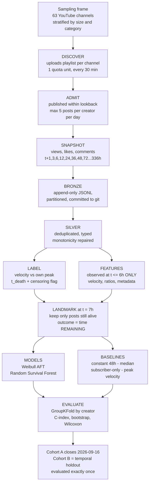

# Content Death Clock — Progress Presentation

**RV University · 7th Semester · Research Methodology + Big Data Analytics**
Amogha V Prasad · S Anannya · Sanidhya Tiwari · Shubhang Srinivas Varda

Prepared 2026-09-05 for the 2026-09-07 review. Every number in this document is
measured from this repository on 2026-09-05 and is re-derivable with the command
named beside it. Nothing here is estimated or rounded up.

---

## 0. How to use this file

The teacher asked for: literature survey (2 papers, **explained in depth**), research
gap, flowchart of the proposed plan, dataset description, implementation if any, and
general progress. Sections 2–9 map onto those in that order.

Suggested deck: **12–14 slides**. The mapping is in §11. The literature survey (§3)
should be **4 slides minimum** — that is where the marks are, because the brief says
one-paragraph summaries will not score.

> **The single most important framing.** Do not present this as "we are building an
> AI tool that predicts virality." Present it as: *the literature predicts how much
> attention content will get; we predict when it stops getting any — and that is a
> different statistical problem, a time-to-event problem, which requires different
> methods and a dataset nobody can download.*

---

## 1. The project in one paragraph

Research on social media content overwhelmingly predicts **growth** — which posts go
viral, how large a cascade becomes, what a video's view count will be at some horizon.
We ask the complementary question: given that attention is finite and decays, **when
does a post stop receiving meaningful attention?** We define "attention death"
operationally, collect repeated real observations of real posts every 30 minutes for
up to 14 days, and test whether the time of death can be predicted from signals visible
in the first few hours. The design was pre-registered and frozen before any result
existed.

---

## 2. Research question and hypotheses

**RQ.** Can the time at which a social media post stops receiving meaningful attention
be predicted from signals observable within the first six hours after publication?

| | Hypothesis |
|---|---|
| **H1** (primary) | A model using early-engagement and metadata features at t ≤ 6h predicts time-to-attention-death more accurately than a naive constant-lifetime baseline. |
| **H2** (secondary, *the one that matters*) | Early engagement **velocity** carries predictive information beyond creator size alone — the model beats a follower-count-only baseline. |
| **H3** (exploratory) | Time-to-death differs across creator-size strata and content categories. Not used to support the main claim. |

Say out loud in the presentation why H2 is the real test: *beating "everything dies at
48 hours" is trivially easy and proves almost nothing. Beating creator size proves the
dynamics carry signal.* That sentence is worth a mark on its own.

---

## 3. Literature survey

Three papers. Two are covered in the depth the brief demands; the third is short and
exists specifically to close off the obvious objection ("hasn't decay been studied?").

### 3.1 Szabó & Huberman (2010) — the foundational result this field is built on

> Szabó, G. and Huberman, B. A. "Predicting the popularity of online content."
> *Communications of the ACM*, 53(8), 2010, pp. 80–88. Preprint: arXiv:0811.0405 (2008).

**The problem they set.** Given a piece of user-generated content, can its popularity
at some distant future time be predicted from measurements taken shortly after it is
published? They deliberately choose the simplest possible framing: no network
structure, no content analysis, no social graph — only the accumulating count itself.

**The core empirical finding (this is the part to explain slowly).** They separate two
time points: an **indicator time** t_i, early in the content's life, and a **reference
time** t_r, far later, which is what you want to predict. Their observation is that if
you take the logarithm of the popularity at t_i and the logarithm of the popularity at
t_r, the relationship between them is **strongly linear**. Not the raw counts — the
raw counts are wildly heavy-tailed and a linear fit on them is meaningless. On the
log-transformed scale the relationship becomes linear *and* the residual scatter around
it becomes approximately normally distributed, which is what licenses ordinary
least-squares and gives well-behaved confidence intervals.

**Why the log transform is the whole trick.** Popularity is multiplicative: a video
that has 10× the views at hour one tends to have roughly 10× the views at day thirty.
Multiplicative processes become additive under a logarithm. So the noise term is
additive *on the log scale*, which is exactly where they report finding the strongest
correlation. The practical consequence, in their own framing, is that you can predict
the **order of magnitude** of eventual popularity from the order of magnitude of early
popularity.

**The models.** From that finding they derive linear predictors on the log scale,
including a constant-scaling model (multiply early count by a learned factor) and
regression variants fitted on the log-transformed data. The model is essentially
one parameter per lead time — deliberately minimal.

**Data and horizons.** Two platforms, chosen because their attention dynamics differ:

- **Digg** — measuring access during roughly the **first two hours** was enough to
  forecast popularity **30 days** ahead with high accuracy.
- **YouTube** — the same predictive performance required following a video for about
  **10 days**.

**The authors' own stated limitation, which is directly our opening.** They note the
method works best on content whose attention decays quickly, and that **evergreen
content is prone to larger errors**. In other words: the accuracy of the entire
approach depends on *how fast the content dies* — a quantity the model never estimates
and never predicts. It is treated as a nuisance property of the dataset.

**What was new in 2008–2010.** Before this, popularity prediction was largely treated
as requiring rich features — social graph, content, uploader. Szabó and Huberman showed
that a single scalar time series, correctly transformed, carries most of the signal.
That is a negative result about feature engineering and a positive result about
scaling, and it set the baseline every later paper is measured against.

### 3.2 Pinto, Almeida & Gonçalves (2013) — the state of the art this project inherits

> Pinto, H., Almeida, J. M. and Gonçalves, M. A. "Using early view patterns to predict
> the popularity of YouTube videos." *Proceedings of the 6th ACM International
> Conference on Web Search and Data Mining (WSDM '13)*, Rome, February 2013,
> pp. 365–374.

**The problem they identify with Szabó–Huberman.** S-H compresses a video's early life
into essentially one number — the count at the indicator time. But two videos can reach
identical view counts at t_i by completely different routes: one climbing steadily, one
spiking on day one and collapsing. S-H cannot tell them apart, yet their futures differ
sharply. Pinto et al.'s thesis is that the **shape** of the early view series, not just
its endpoint, carries information.

**Model 1 — ML (Multivariate Linear).** Instead of one input, the model takes the
**vector of view increments** across each of the early sampling intervals. So a video
observed over its first *n* intervals contributes an *n*-dimensional feature vector,
and the regression learns a separate coefficient per interval. This directly extends
S-H: constrain all the coefficients to a single scaled term and you recover the S-H
model as a special case. The added capacity is exactly the ability to distinguish
early-peaked from steadily-growing trajectories.

**Model 2 — MRBF (Multivariate Radial Basis Function).** The ML model is still linear,
so it can only learn one global weighting of the early intervals. MRBF adds a
**similarity** component. A set of training videos is selected as reference points; for
a new video, a radial basis function is computed between its feature vector and each
reference video's, giving a measure of *how close this video's early trajectory is to
each known trajectory*. Those RBF distances are appended to the ML features. The effect
is a model that can say "this video is behaving like that cluster of videos, and they
ended up here" — a local, non-linear correction on top of the global linear trend.

**Evaluation metric — mRSE.** They report **mean Relative Squared Error**: the squared
prediction error normalised by the true value, averaged over videos. Normalising matters
because view counts span many orders of magnitude — an absolute error of 1,000 views is
catastrophic for a small video and negligible for a large one. mRSE makes errors
comparable across scales.

**Results.** The ML model reduces mRSE over the S-H baseline by roughly **15%** and
**13%** on their two datasets (a random sample and a "top" sample). Combined with
category information, the best reported configuration reaches mRSE of about **0.2014**.
Crucially, they report that **the largest gains occur precisely for videos that spike
early and then decline sharply** — the videos whose defining characteristic is *fast
decay*.

**What was new.** Three things: (1) treating the early view series as a multivariate
signal rather than a scalar; (2) introducing trajectory *similarity* via RBFs so the
model can exploit recurring decay shapes; (3) demonstrating that the benefit
concentrates in fast-decaying content.

**And the gap that leaves.** Their own best-case scenario is videos that die fast — and
yet the output is still *a view count at a future date*. The dying is what makes the
prediction work, and it is still never the thing predicted.

### 3.3 Crane & Sornette (2008) — decay is described, but not predicted

> Crane, R. and Sornette, D. "Robust dynamic classes revealed by measuring the response
> function of a social system." *PNAS*, 105(41), 2008, pp. 15649–15653.

Include this to pre-empt the obvious challenge. Using daily view counts for nearly
**5 million** YouTube videos, they show that while most activity is well described as a
Poisson process, hundreds of thousands of videos exhibit a burst followed by a
**power-law relaxation**, and that the relaxation exponents cluster into **three distinct
dynamic classes**, separating endogenously-driven from exogenously-driven bursts. It is
grounded in an epidemic model on a social network.

**Why it does not close our gap.** This is a *descriptive, retrospective, aggregate*
characterisation of decay: it classifies decay shapes after the fact, across millions of
videos, at daily resolution. It does not produce a per-post prediction, it does not
operate from early signals only, and it never asks "when will *this* post die?" It
establishes that decay is real, structured, and worth studying — which is our
motivation, not our competitor.

---

## 4. Research gap

Put this table on a slide almost verbatim. It is the strongest single artefact in the deck.

| | Szabó & Huberman 2010 | Pinto et al. 2013 | Crane & Sornette 2008 | **This project** |
|---|---|---|---|---|
| **Predicts** | Popularity **volume** at a future time | Popularity **volume** at a future time | Nothing (descriptive) | **Time until attention stops** |
| **Output type** | A count | A count | A dynamic class | **A duration (time-to-event)** |
| **Uses early signal only** | Yes | Yes | No (full history) | Yes (≤ 6h, hard constraint) |
| **Handles content still alive at end of study** | Not applicable | Not applicable | Not applicable | **Yes — right-censoring** |
| **Statistical family** | Log-linear regression | Linear + RBF regression | Response-function fitting | **Survival analysis** |
| **Treats decay as** | A nuisance limiting accuracy | The regime where gains are largest | The object of description | **The dependent variable** |

**The gap, stated in one sentence for the slide:**

> Existing work predicts *how much* attention content will receive and treats the speed
> of decay as either a limitation or a descriptive curiosity. No work we found frames
> the *end of attention* as a per-post, right-censored, time-to-event prediction problem
> driven by early signals.

**Why this is a genuine methodological gap, not just a relabelling.** Three consequences
follow that a regression framing cannot handle:

1. **Censoring.** Some posts are still alive when observation ends. A regression must
   either drop them — biasing the sample toward short-lived content and inflating every
   number reported — or invent a value for them. Survival analysis keeps them as
   *right-censored* observations that contribute the information "it lasted at least
   this long." This is not a detail; it is the reason the problem needs a different
   model family.
2. **The metric changes.** Predicting a duration under censoring is evaluated with
   Harrell's C-index (a concordance measure), not RMSE.
3. **Landmarking becomes mandatory.** If a post can die *inside* the window your
   features are computed from, "predicting" it is circular. Survival analysis has a
   standard remedy — the subject must be at risk at the moment prediction is made — and
   we had to apply it (see §8).

---

## 5. Proposed method

### 5.1 Operational definitions (the part examiners probe)

**Attention death.** The first time engagement velocity falls below **5% of that post's
own peak velocity** and stays below for **2 consecutive intervals**.

- *Why normalise against the post's own peak?* It is what makes a 300-view post and a
  3M-view post comparable on the same scale. An absolute threshold would simply
  re-measure creator size.
- *Why "sustained for 2 intervals"?* A single dip is noise; death should be a state, not
  a moment.
- Velocity is computed on **actual observed timestamps**, never an assumed grid, because
  schedulers drift and a late snapshot must be late-but-honest.

**Right-censoring.** A post still alive when observation ends has not died. It is kept,
flagged `event_observed = False`, and handed to the survival model.

**Robustness label.** `t_saturation` — time to reach 90% of the asymptote *A* from a
fitted C(t) = A(1 − e^(−kt)). Reported alongside. Systematic disagreement between the
two labels is a finding to report, not a problem to hide.

### 5.2 Flowchart

Paste into <https://mermaid.live> to render a PNG for the slide.

**The one thing to point at while showing this:** the box at `t = 7h` and the arrow
from `FEATURES` that carries a hard constraint — *nothing observed after 6 hours may
enter a feature*. That constraint is what makes the task prediction rather than
description.

### 5.3 Models, baselines, validation

| | |
|---|---|
| **Primary models** | Weibull AFT; Random Survival Forest (both censoring-aware) |
| **Comparators** | Log-time linear regression; gradient boosting (uncensored subset) |
| **Baselines (all four reported)** | 1. Constant 48h · 2. Training-set median lifetime · 3. **Subscriber-count only** · 4. Peak-velocity heuristic |
| **Validation** | `GroupKFold(n_splits=5)` **grouped by creator** |
| **Metrics** | Harrell's C-index (primary); MAE/RMSE on log₁₀ time (uncensored subset); calibration plot |
| **Inference** | Paired Wilcoxon signed-rank on per-post errors; bootstrap (2,000 resamples, **resampled by creator**); α = 0.05; effect sizes alongside p-values |

**Grouping by creator is pre-specified and worth a sentence.** Random k-fold would put
the same creator in both train and test, leaking creator identity and inflating scores.
It is written into the frozen plan precisely so it cannot be quietly relaxed later.

---

## 6. Dataset description

**This is collected, not downloaded.** Say that explicitly — the brief says "only if you
have downloaded any," and the honest answer is stronger: *no such dataset exists to
download, because decay labels are wall-clock bound. A post's first six hours can be
observed once and never again.*

### 6.1 Current scale — measured 2026-09-05

Re-derive with `python -m cdc.collect.monitor`.

| | YouTube | Instagram | Total |
|---|---|---|---|
| Posts tracked | **368** | 396 | **764** |
| Snapshots collected | **3,045** | 1,506 | **4,551** |
| Distinct creators | 43 | 24 | 67 |
| Mean snapshots per post | 8.3 | 3.8 | — |

**Collection quality** (YouTube, the primary dataset):

| | |
|---|---|
| Mean schedule completeness | **90.8%** |
| On-time only (inside the mark's own tolerance) | 87.2% |
| Mean lateness | +0.20 h (worst +3.97 h) |
| Cycle-hours observed | 129 |
| Known outages | one, 7 consecutive hours from 2026-08-31T02 |

Coverage by scheduled mark — a good slide, because it shows the panel is genuinely
longitudinal rather than a single scrape:

| Mark | t+1h | t+3h | t+6h | t+12h | t+24h | t+36h | t+48h | t+72h | t+96h | t+120h |
|---|---|---|---|---|---|---|---|---|---|---|
| Posts observed | 193 | 342 | 351 | 237 | 327 | 310 | 276 | 234 | 190 | 151 |

### 6.2 Sampling frame

63 public YouTube channels, resolved and verified against the API on 2026-08-30, in
`config/channels.resolved.yaml`.

| Tier | n | Subscriber range (measured) |
|---|---|---|
| micro (<10k) | 16 | 1 – 7,250 |
| mid (10k–500k) | 17 | 10,800 – 439,000 |
| large (>500k) | 30 | 549,000 – 515,000,000 |

Eight categories: entertainment (19), technology (13), education (12), science (7),
news (5), gaming (5), automotive (1), talk (1).

**State the sampling claim plainly — do not overclaim.** This is **not** a random sample
of YouTube. It is the set of channels reachable by a fixed, committed query list
(`config/discovery_queries.yaml`), filtered by size and upload frequency. Generalisation
beyond that frame is not claimed. The queries are committed, so a third party can
reproduce the frame — a weaker claim than random sampling, a much stronger one than an
unrecorded convenience sample.

**Known frame biases, stated in advance:** the query list leans toward Indian and
long-tail creators; channels uploading less than weekly are excluded by construction, so
frequent uploaders are over-represented; neither the micro nor mid tier covers its full
nominal range.

### 6.3 Variables

**Dependent:** `t_death` (+ `event_observed`), robustness DV `t_saturation`.

**Independent — hard constraint, nothing observed after t = 6h:** early velocity at 1h,
3h, 6h; log growth ratios between consecutive snapshots; acceleration; video duration;
title length; tag count; publish hour and weekday; category; creator subscriber count;
creator historical median velocity.

**Instagram is a feasibility demonstration, not a second test set.** The Scrape Creators
credit budget cannot fund a continuous panel at useful size, so Instagram runs as bounded
cohorts. Its purpose is to show the pipeline generalises across platforms and to supply
one cross-platform figure. **n is too small for inference and no hypothesis is tested on
it.** Note also that Instagram reports no view count for image posts, so its primary
metric is *likes*, which saturate faster than views — death times are therefore **not
comparable across platforms** and are never pooled.

---

## 7. Implementation status

The brief says implementation is optional. You have a substantial one, so show it briefly
— one slide, not five.

| Stage | Module | Status |
|---|---|---|
| Discovery | `cdc.collect.youtube` | Working — uploads playlist, 1 quota unit (never `search.list`, which costs 100) |
| Snapshotting | `cdc.collect.runner` | Working — batched 50 ids/call, running every 30 min |
| Storage | `cdc.storage.bronze` | Working — append-only, partitioned, atomic commit |
| Panel state | `cdc.collect.panel` | Working — rebuilt *from bronze*, no separate state file to drift |
| Labels | `cdc.labels.death` | Implemented, unit-tested against analytically known answers |
| Features | `cdc.transform.features` | Implemented |
| Models | `cdc.models.survival` | Implemented (Weibull AFT, RSF) |
| Evaluation | `cdc.eval` | Implemented (GroupKFold, bootstrap, Wilcoxon) |
| Monitoring | `cdc.collect.monitor` | Working — completeness, lateness, outage alarm wired into CI |

**Infrastructure worth one line each:** collection runs unattended in GitHub Actions on
an external 30-minute trigger (GitHub's own scheduler was measured firing roughly one
slot in three, so it is kept only as fallback); the quota cost model is `C + ceil(V/50)`
units per cycle against a 10,000/day budget; **195 automated tests** pass, including an
offline end-to-end test that drives the real runner through a simulated 21-day collection
against a fake API.

**On results: deliberately none yet.** The pre-registered plan fixes Cohort A's close at
**2026-09-16T00:00:00Z**, set on 2026-08-30 before any outcome data was examined. The
evaluation tooling refuses to present findings below 50 observed deaths and prints
*"rehearsal only — do not quote these numbers."* Saying this out loud is a strength, not
an apology.

---

## 8. Methodological rigour — the differentiator

This is what separates the project from "we built a tool." Give it a slide.

**The analysis plan was pre-registered and frozen on 2026-08-30**, committed to git
before any outcome data existed — at that moment 179 posts collected, **0 death labels
computed, 0 models fitted, 0 results examined**. Its value comes entirely from being
timestamped *before* we knew what the results looked like.

**Amendments are made as new dated commits with stated reasons, never by editing the
frozen file.** Four so far, and each one is a defect we found and reported rather than
hid:

| Date | Amendment | Why |
|---|---|---|
| 2026-08-31 | Per-creator daily cap (max 5 posts/creator/day, YouTube) | One channel published **100 videos in 25 seconds** and came to supply **59%** of the panel, at a median of 4 views against 1,152 for every other post. Those are not 100 independent observations. |
| 2026-09-01 | **Landmark design** — predict *remaining* lifetime from t = 7h | **53% of observed deaths fell inside the 6-hour feature window.** A post dying at 3.1h has its death determined by the observations its features are built from — circular, not predictive. |
| 2026-09-02 | Instagram Cohort B restructured: 3 accounts × 72h, not 5 × 48h | Cohort A produced 326 posts at a median of **one** snapshot each and **one** observed death. Credits buy curve *depth*, not panel *width*. |
| 2026-09-05 | Instagram collection gap recorded | An API fault returned empty payloads for 18 hours; a defect in our own rate limiter tripled spend during it. Recorded so the gap is reported rather than discovered in the data later. |

**If you present one story, present the landmark one.** It is the most intellectually
honest moment in the project: *we discovered our own task definition was circular, and
we changed the design rather than the result.* Note the supporting detail — the collector
runs every 30 minutes, so the nominal 6-hour reading lands at a median of 6.08h; a strict
6.00h cutoff discarded it for 72 of 86 posts, which is why every 6-hour feature was 0%
available. Moving the landmark to 7h took usable feature columns from 4 to 8.

**Committed in advance:** if the model does not beat the baselines, that is the reported
result. A negative finding with an honest power discussion is a legitimate RM paper.
Searching for a specification that wins is not.

---

## 9. Limitations (state them yourself, before you are asked)

- **Observational design; no causal claim.** We predict decay, we do not explain it.
- **Not a random sample of YouTube** — generalisation beyond the committed frame is not
  claimed.
- **Views are platform-reported** and cannot be independently audited.
- **The 14-day window truncates genuinely long-lived content** — which is exactly what
  censoring-aware modelling exists to handle.
- **Scrape Creators is an unofficial third-party API**, disclosed as a stated limitation
  rather than buried.
- **Statistical power is the live risk.** The binding constraint is not posts but
  *observed deaths*; censoring rates in early rehearsal runs were high. The power
  discussion is planned as part of the result, not as an excuse after it.

---

## 10. Timeline

| Milestone | Date | Status |
|---|---|---|
| Analysis plan frozen | 2026-08-30 | Done |
| Collection live, unattended | 2026-08-30 | Running, 90.8% complete |
| **Cohort A closes** | **2026-09-16** | Pre-specified, fixed in `settings.yaml` |
| Model fitting + evaluation | after 2026-09-16 | Implemented, not yet run for record |
| Cohort B temporal holdout | end of collection | Evaluated **exactly once** |
| Papers (RM + BDA) | end of semester | Method sections final; results scaffolded with `[PENDING]` |

---

## 11. Suggested slide plan

| # | Slide | Source |
|---|---|---|
| 1 | Title + one-line hook: *"Everyone predicts what goes up. We predict when it stops."* | §1 |
| 2 | Research question + H1/H2/H3 | §2 |
| 3 | Literature 1 — Szabó & Huberman: the log-linear result | §3.1 |
| 4 | Literature 1 — their method, horizons, and their own stated limitation | §3.1 |
| 5 | Literature 2 — Pinto et al.: why one number is not enough (ML model) | §3.2 |
| 6 | Literature 2 — MRBF, mRSE, results, and what was new | §3.2 |
| 7 | Crane & Sornette: decay is described but never predicted | §3.3 |
| 8 | **Research gap table** | §4 |
| 9 | Operational definition of "attention death" | §5.1 |
| 10 | **Flowchart** | §5.2 |
| 11 | Dataset: scale, completeness, coverage-by-mark table | §6.1 |
| 12 | Sampling frame + honest sampling claim | §6.2 |
| 13 | Implementation status + infrastructure | §7 |
| 14 | Pre-registration and the four amendments | §8 |
| 15 | Limitations + timeline | §9, §10 |

Slides 3–7 are the graded core. If time is short, cut 13, not 6.

---

## 12. References

1. Szabó, G. and Huberman, B. A. (2010). Predicting the popularity of online content.
   *Communications of the ACM*, 53(8), 80–88. Preprint: arXiv:0811.0405.
   <https://arxiv.org/abs/0811.0405>
2. Pinto, H., Almeida, J. M. and Gonçalves, M. A. (2013). Using early view patterns to
   predict the popularity of YouTube videos. In *Proc. 6th ACM Int. Conf. on Web Search
   and Data Mining (WSDM '13)*, 365–374.
   <https://www.semanticscholar.org/paper/5ee3da8b1577de0de75e45ba498095c08bc349ff>
3. Crane, R. and Sornette, D. (2008). Robust dynamic classes revealed by measuring the
   response function of a social system. *PNAS*, 105(41), 15649–15653.
   <https://www.pnas.org/doi/abs/10.1073/pnas.0803685105>

*Optional further reading if you want a fourth:* Tatar, A. et al. (2014), "A survey on
predicting the popularity of web content," *Journal of Internet Services and
Applications*, 5(8) — useful for framing the field, though a survey is weaker as a
"detailed methodology" subject than a primary paper.

---

## 13. Appendix — do NOT present this

A rehearsal evaluation was run on 2026-09-01 on partial data (60 posts, 7 observed
deaths, 88.3% censoring). **These are not results and must not go in the deck.** The
tooling itself labels them `underpowered: true` and refuses to present them, because
below ~50 observed deaths a C-index is noise. Quoting them would break the
pre-registration discipline that is the project's strongest asset, and would invite a
question you cannot answer well. If asked directly whether you have run anything, the
correct answer is: *"the pipeline has been smoke-tested end to end, but the analysis set
does not close until 16 September and we committed in advance to not reporting before
then."*

One number in the frozen plan has drifted and is worth knowing before someone spots it:
the plan states the micro tier spans 1,240–7,250 subscribers; the resolved frame now
contains one channel measured at 1 subscriber, so the true range is 1–7,250. Not
material, but say the measured number if the topic comes up.
